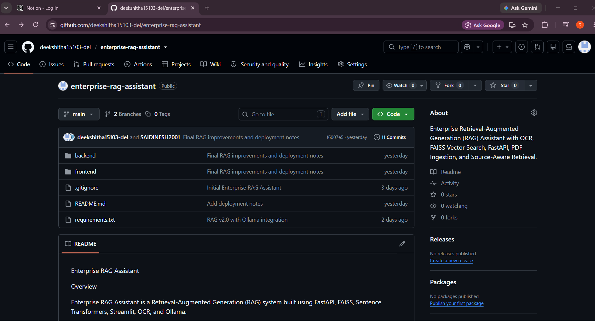
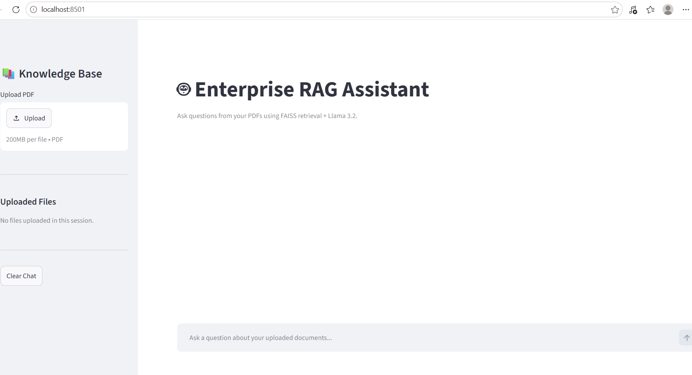
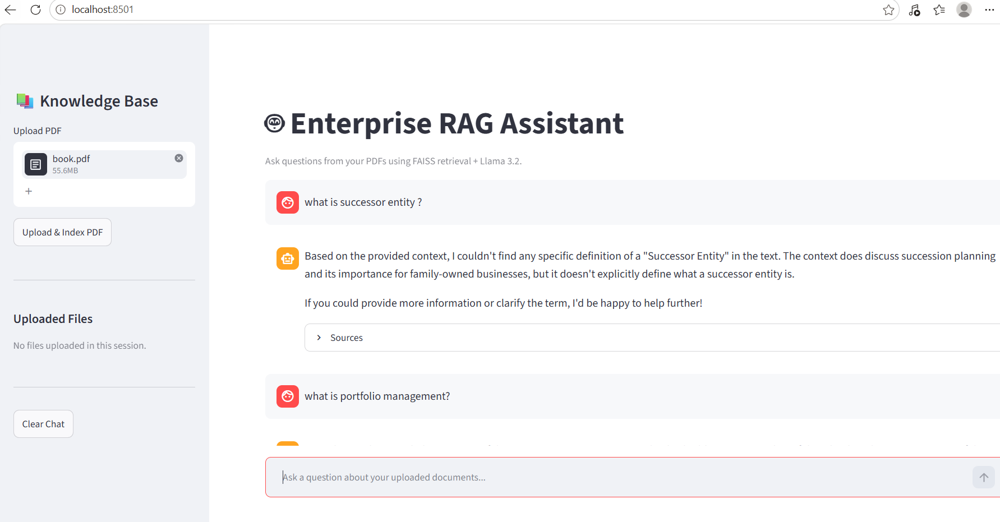

# Enterprise RAG Assistant

## Overview

Enterprise RAG Assistant is an end-to-end Retrieval-Augmented Generation (RAG) system built using FastAPI, FAISS, Sentence Transformers, Streamlit, OCR, and Ollama.

The application enables users to upload one or more PDF documents, automatically extract text (including scanned PDFs using OCR), generate vector embeddings, store them in a FAISS vector database, and perform semantic search over the uploaded knowledge base.

Answers are generated using Llama 3.2 through Ollama and include source references from the retrieved document chunks, improving transparency and explainability.

---

## Live Demo & Deployment Notes

### GitHub Repository

https://github.com/deekshitha15103-del/enterprise-rag-assistant

### Render Deployment

https://enterprise-rag-assistant-j60w.onrender.com

### Swagger API Documentation

https://enterprise-rag-assistant-j60w.onrender.com/docs

### Deployment Note

The complete Enterprise RAG Assistant runs locally using:

* Ollama
* Llama 3.2
* FAISS Vector Database
* Sentence Transformers
* OCR Pipeline
* Streamlit Frontend

The hosted Render deployment uses a lightweight configuration because the Render Free Tier provides only 512 MB RAM, which is insufficient for running the complete local RAG pipeline with Ollama and vector retrieval.

The full-featured local version demonstrated in this repository includes:

* Multi-PDF Support
* Conversational Memory
* OCR Processing
* Semantic Search
* Source Attribution
* Streamlit Frontend
* Ollama-Based Answer Generation

---

## Features

### Document Processing

* PDF Upload
* Multi-PDF Knowledge Base
* OCR Support for Scanned PDFs
* Automatic Text Chunking
* Persistent Document Storage

### Retrieval System

* Sentence Transformer Embeddings
* FAISS Vector Database
* Semantic Search
* Source-Aware Retrieval
* Multi-Document Retrieval

### LLM Integration

* Ollama Integration
* Llama 3.2 Local Inference
* Context-Aware Responses
* Conversational Memory

### Frontend

* Streamlit Chat Interface
* Sidebar Document Management
* Chat History
* Clear Chat Option
* Source Citations

### Backend

* FastAPI REST API
* Swagger Documentation
* Persistent FAISS Index Storage
* Persistent Chunk Storage

---

## Screenshots

### GitHub Repository



### Application Interface



### Question Answering Demo



### Source Attribution


---

## Architecture

PDF Documents

↓

OCR / Text Extraction

↓

Text Chunking

↓

Sentence Transformer Embeddings

↓

FAISS Vector Database

↓

Semantic Retrieval

↓

Context Generation

↓

Llama 3.2 (Ollama)

↓

Answer + Sources

↓

Streamlit Frontend

---

## Tech Stack

### Backend

* Python 3.11
* FastAPI
* Uvicorn

### Retrieval

* FAISS
* Sentence Transformers

### Document Processing

* PyPDF
* Tesseract OCR
* PDF2Image

### LLM

* Ollama
* Llama 3.2

### Frontend

* Streamlit

---

## API Endpoints

### GET /

Health Check Endpoint

### GET /health

Application Health Status

### GET /history

Retrieve Chat History

### DELETE /history

Clear Chat History

### POST /upload

Upload and index PDF documents

### POST /ask

Ask questions against the indexed knowledge base

---

## Project Structure

enterprise-rag-assistant/

├── backend/

│ ├── api/

│ ├── rag/

│ ├── retrieval/

│ └── cache/

│

├── frontend/

│ └── app.py

│

├── screenshots/

├── README.md

├── requirements.txt

└── .gitignore

---

## Current Status

### Completed

* OCR Pipeline
* PDF Ingestion
* Multi-PDF Support
* Semantic Search
* FAISS Vector Database
* Source Attribution
* Chat History
* Streamlit Frontend
* Ollama Integration
* Llama 3.2 Integration
* FastAPI Backend
* GitHub Integration

### Future Enhancements

* Page-Level Citations
* Cloud Deployment Optimization
* Authentication
* AWS Bedrock Integration
* Analytics Dashboard

---

## Local Run

### Backend

```bash
uvicorn backend.api.app:app --reload
```

### Frontend

```bash
streamlit run frontend/app.py
```

---

## Author

**Deekshitha**

B.Tech Computer Science Engineering

AI/ML Enthusiast
